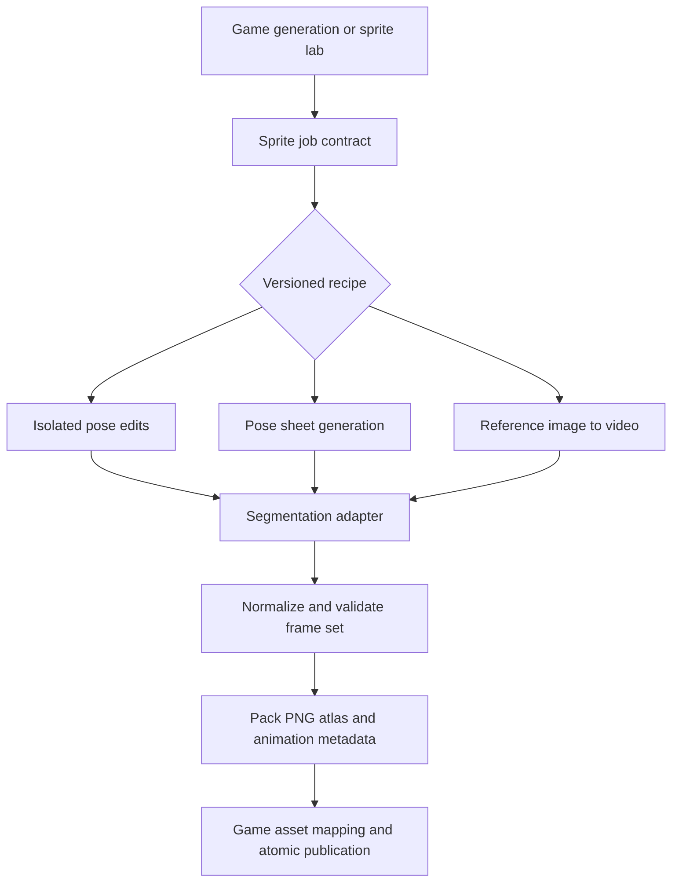

# Sprite generation: SAM masks, interchangeable recipes, and video animation

Status: proposed architecture and staged rollout. Researched against the repository and public
provider documentation on 2026-09-19. The first lab slice is now implemented: SAM still-image
adapter, masking separated from normalization, and persisted four-way comparisons in the
platformer pose lab, including a SAM-guided chroma boundary with protected interior colors.
Saved SAM responses can be reprocessed without another API call. Production still uses chroma keying. See the
[comparison instructions](../EXTENDING.md#sprite-background-removal-comparisons).

The [standalone sprite utility contract](sprite-service-contract.md) expands the service boundary
into a reusable character library, identity revisions, recipe catalog, output manifest, and quoted
jobs shared by a future website/API and Sparkade. It is a proposal, not implemented product scope.

The first deliverable should be a measured SAM background-removal experiment using existing raw
sprite outputs. In parallel with that design, establish a sprite-generation boundary that can run
different recipes behind one contract. Start as an internal package using the existing durable
generation infrastructure; add an independently deployed worker when video processing warrants it.

## What exists today

- [`fighter-pose.ts`](../../packages/server/src/assets/fighter-pose.ts) combines green keying,
  optional spill removal, component selection, validation, crop, nearest-neighbor resize, grounding,
  and palette encoding. Many other archetypes call this processor. Its default validation requires
  a minimum amount of removable green, even when an input already has transparency.
- [`platformer-pose.ts`](../../packages/server/src/assets/platformer-pose.ts) enables spill cleanup,
  normalizes poses to a common subject height, and checks that each pose touches the bottom edge.
  These rules suit the current pose set but cannot preserve the airborne portion of a video run cycle.
- [`fighter-pose-sheet.ts`](../../packages/server/src/assets/fighter-pose-sheet.ts) owns the sheet
  layout and foreground-component assignment. Replacing a mask must preserve this ownership logic
  so a limb crossing a cell boundary is not cut off or copied into two cells.
- [`runner.ts`](../../packages/server/src/pipeline/runner.ts) owns generation branches and retries;
  [`meta-image.ts`](../../packages/server/src/providers/meta-image.ts) supplies a dedicated image
  adapter. The mask lab now has a still-image SAM adapter, but durable segmentation and video
  execution are not yet integrated into the game pipeline.
- [`durable-pass.ts`](../../packages/server/src/pipeline/durable-pass.ts) currently supports text
  and image provider tasks. Deterministic passes replay persisted responses and suspend on missing
  external work. SAM must become explicit durable work, rather than a network request hidden in
  image normalization.
- [`manifest.ts`](../../packages/server/src/assets/manifest.ts) already records hashes, models,
  prompt versions, and private references. The
  [cloud runtime](cloud-generation.md) already provides private Blob artifacts, Neon job state,
  usage, cancellation, and atomic publication.
- The [platformer](../../packages/server/src/api/dev-platformer-poses.ts) and
  [fighter](../../packages/server/src/api/dev-fighter-poses.ts) labs already retain experimental
  evidence. The platformer runtime currently animates `walk1`, `sideIdle`, and `walk2` in
  [`game.ts`](../../packages/archetypes/src/platformer/game.ts); exporting eight frames alone will
  not make the game play an eight-frame animation.

The existing tests deliberately protect green clothing while removing green residue. That is a
real constraint: widening a global color threshold can damage valid sprite pixels. The reported
failures still need a representative raw-image corpus; this inspection establishes the mechanism,
not a verified diagnosis of every affected sprite.

## SAM integration

SAM should estimate the foreground silhouette at source resolution before crop, resize, and
palette reduction. Segmentation is separate from edge-color repair: a correct mask can retain a
boundary pixel whose RGB value already contains green contamination. Measure both outcomes.

The hosted API uses `sam-3.1` through `/v1/responses` with a short text concept and image or video.
It currently accepts text prompts, not point/box prompts. Zero matches is a valid API response.
Use a separately authored `subjectConcept` such as `knight` or `spaceship`, rather than sending the
long image-generation instruction as the segmentation prompt. Check composite subjects such as a
rider and vehicle explicitly. [Meta request documentation](https://dev.meta.ai/docs/sam/segmenting).

Use `@meta-sam/parser` to consume output and decode masks; its raster helper produces binary
values. SAM segmentation therefore does not by itself provide an alpha-matting or color-recovery
solution. Verify source-coordinate placement, orientation, mask dimensions, and box geometry using
known fixtures before compositing. [Meta client libraries](https://dev.meta.ai/docs/sam/client-libraries).

Extract these stages from the shared processor:

1. Decode and orient source pixels once.
2. Obtain a mask through an explicit strategy: existing chroma key, SAM, or an experimental SAM
   mask with boundary-only color cleanup.
3. Select the intended subject using the requested asset role, expected placement, and reference.
   For a sheet, associate instances with cells geometrically; do not assume SAM object order is
   pose order. Reject ambiguous selections instead of silently choosing the largest object.
4. Apply the mask to the original RGB pixels, preserving any pre-existing transparency. Keep
   interior green details. Restrict optional despill to a narrow boundary band and record it.
5. Normalize according to the output profile, validate the silhouette, and encode the palette PNG.

Keep green-specific checks in the chroma strategy. SAM validation should check usable coverage,
subject selection, clipping, missing parts, and retained background; passing a transparent SAM
result back through mandatory green keying would either reject it or erase legitimate colors.
Component rules must also account for valid detached equipment or effects in the asset contract.

Initially compare strategies on identical green-screen originals. Only after isolating the mask
improvement should we test generation against neutral backgrounds, which may reduce color spill.
Never silently change the background prompt in the middle of that comparison.

## Stable service boundary

The game pipeline requests a sprite asset or animation with explicit visual and runtime constraints.
A versioned **recipe** chooses the procedure; provider adapters perform individual model calls.
For example, changing Muse Image to another image provider does not necessarily change the recipe,
while replacing six separate pose edits with one video does.

Suggested recipes are `isolated-poses-v1`, `pose-sheet-v1`, and `video-cycle-v1`. Segmentation,
provider/model selections, and processing versions are pinned in the job configuration. Each
recipe declares its supported output profiles; a run-cycle recipe cannot satisfy a fighter's full
action-state roster just because both return PNGs.

Start with `packages/spriting` for contracts, deterministic processing, and recipe definitions.
Expose provider calls, artifact storage, progress, and durable execution as injected interfaces.
It must not import the game runner, database, or website. Keep archetype-to-sprite request mapping
and gameplay semantics in Sparkade. Migrate one caller at a time while preserving its current
output files and required-set activation rules.

The logical contract should contain:

| Area | Fields and responsibility |
| --- | --- |
| Request identity | Schema version, owner/environment scope, parent job, idempotency key |
| Source | Immutable reference artifact IDs and content hashes; optional supplied image/video |
| Desired result | Subject concept, identity constraints, named poses/actions, facing, art style, allowed props |
| Runtime profile | Cell dimensions, padding, anchor convention, palette policy, frame count/timing, loop intent |
| Execution | Recipe/version, provider/model configuration, prompt/processor versions, cost and retry limits |
| Result | Atlas/frame artifact references, frame rectangles, durations, pivots, animation labels, quality report |
| Provenance | Source hashes, provider task IDs, requested/actual model where exposed, prompts, costs, decisions |

Keep the sprite result manifest distinct from the existing public game manifest. A game adapter
maps approved sprite output into current roles, or into a versioned animation extension later.
Final assets contain only what playback needs; private sources and diagnostic masks stay private.
Use hashes to replay completed steps, not as a promise that a fresh model call is deterministic.

If deployed separately, add `POST /v1/sprite-jobs`, `GET /v1/sprite-jobs/:id`, a cursor-based events
endpoint, and `POST /v1/sprite-jobs/:id/cancel`. Submission returns `202` with a durable job ID.
Same-owner retries with the same idempotency key return that job; a changed payload conflicts.
Reuse the existing service authentication approach, scoped storage, and job ownership checks.

Use states such as queued, generating, segmenting, normalizing, validating, succeeded, rejected,
failed, and canceled. A quality rejection differs from a transient provider failure. Provider
adapters expose capabilities and submit/status/result behavior, with cancellation where supported.
Unsupported controls must be visible to the recipe rather than silently ignored.

Extend the current durable task contract for segmentation and video submission/polling. Persist a
provider job ID immediately after submission, then resume polling it after a restart. Archive
completed media before temporary provider URLs expire. Cache artifacts by reference, configuration,
and processing version; store large videos/masks in Blob rather than checkpoint JSON or events.
Retain the existing at-least-once caveat when a provider accepts a request before its ID is saved
and offers no idempotency support. Cancellation prevents promotion even if a provider finishes later.

A separate deployment becomes useful when measured decoding, FFmpeg, memory, or concurrency needs
exceed the current processing steps. The API and package boundary can precede that deployment.
There should be one owner for each sprite job's retries and spending, even when it has a parent
game job. Reconcile sprite usage into the parent ledger once.

## Video-to-sprite recipe

Start with one approved side-view platformer reference and one running animation. Generate a
short clip of the same subject running in place, with a fixed camera, generous margins, and a
simple background. Request several strides so the processor can select a steady interior cycle.
No release date or wire format is assumed for Muse Video.

1. Generate or import a clip and save the exact source.
2. Canonicalize orientation, dimensions, and timing into one supported video. Decode and segment
   that same canonical artifact. Retain its timestamps and frame-index mapping.
3. Segment the clip as video to use temporal tracking, then extract/select sprite frames. SAM
   returns explicit frame indices and object IDs; missing-object frames may be omitted. Track the
   chosen ID rather than list positions, and reject lost subjects instead of recycling stale masks.
   IDs should not be assumed to survive full occlusion or exit/re-entry.
   [Meta output semantics](https://dev.meta.ai/docs/sam/reading-segmentation).
4. Find a complete gait cycle using repeated pose and motion evidence. Evaluate the loop seam,
   opposing contacts, and meaningful motion; sample roughly 6–12 phases for the first experiment.
   Merely selecting every Nth frame or requesting matching endpoints does not establish a loop.
5. Use one scale, shared canvas bounds, and a stable ground/root reference for the entire cycle.
   Preserve authored vertical motion. Do not independently fit every frame to its silhouette or
   force every airborne foot onto the bottom edge. Reject camera/scale drift or correct only
   measured global drift without canceling the intended gait.
6. Quantize against a shared palette, check mask and color flicker, and pack an atlas with durations
   and anchors. Avoid default frame interpolation, which can introduce blended pixels and limbs.
7. Review at native sprite resolution, enlarged on multiple backgrounds, and in gameplay. Check
   identity, silhouette, foot contact, camera motion, loop continuity, and palette stability.

A complete run cycle needs a versioned platformer animation descriptor, asset loading, and renderer
support beyond the current two-contact gait. Keep collision physics and movement speed independent
of generated silhouettes. Connect playback phase to the movement convention deliberately, and
retain existing action-pose behavior. Older bundles continue using the current gait; incomplete or
rejected new cycles activate no partial animation set.

## First video provider and cost envelope

Use a local/imported-video adapter first so extraction, SAM tracking, normalization, and playback
can be exercised without paying for regeneration. Add Runway `gen4_turbo` as an initial inexpensive
image-to-video baseline; compare `gen4.5` if the baseline loses identity or motion quality. Both are
listed in [Runway's model documentation](https://docs.dev.runwayml.com/guides/models/).
This is an integration starting point, not a measured claim about sprite quality.

Veo 3.1 is a useful second experiment because it accepts first and last frames. That gives another
way to constrain a cycle, but does not guarantee continuous velocity at the seam.
[Veo documentation](https://ai.google.dev/gemini-api/docs/veo).
Prefer one working provider adapter and a capability test suite before expanding the provider list.
Muse Video can later implement the same interface, with its own prompt tuning and quality evaluation;
swapping adapters does not imply identical supported controls or output quality.

Published prices checked on 2026-09-19:

| Operation | Listed rate | Illustrative one-attempt cost |
| --- | --- | --- |
| SAM image | $2.50 / 1,000 images | $0.0025 per sprite source |
| SAM video | $0.20 / 1,000 frames | $0.024 for 120 frames |
| Runway Gen-4 Turbo | 5 credits/second, $0.01/credit | $0.25 for 5 seconds |
| Runway Gen-4.5 | 12 credits/second, $0.01/credit | $0.60 for 5 seconds |

Sources: [Meta pricing](https://dev.meta.ai/docs/pricing-rate-limits) and
[Runway pricing](https://docs.dev.runwayml.com/guides/pricing/).
The 120-frame example assumes a five-second, 24 fps canonical clip; actual media determines billed
frames. These figures exclude reference generation, judging, retries, storage, processing, and tax.
Measure cost per accepted animation and end-to-end latency, not only cost per model invocation.
Snapshot pricing/configuration for a job and enforce its total attempt budget before paid steps.

## Delivery sequence and acceptance evidence

1. **Mask benchmark.** Collect approximately 20–30 retained raw sprites spanning reported residue,
   clean controls, green clothing, fine appendages, enclosed gaps, vehicles, and sheet cells. Compare
   existing keying, SAM, and SAM plus boundary cleanup on identical inputs. Save original, mask,
   transparent output, composites, timing, cost, and human verdict. Annotate a small subset for
   foreground retention and background leakage measurements. No default switch until evidence
   shows fewer visible failures without lost details; do not use “zero green pixels” as the metric.
2. **Production still-image option.** Extract masking from normalization; implement the SAM adapter,
   durable segmentation task, usage accounting, and configuration switch. Pilot a single asset
   family. Verify empty/ambiguous masks, coordinate placement, interrupted streams, retries,
   cancellation, and preservation of existing sprite dimensions/anchors. Any fallback is explicit,
   validated, and recorded. Rollback selects the previous recipe for new jobs.
3. **Recipe boundary.** Move that working path behind the sprite contract and add the current sheet
   path. Preserve the labs and their comparisons. Check semantic parity and unchanged runtime
   outputs before moving remaining callers. Keep existing model judgments and bounded repairs.
4. **Video lab.** Imported clip first, then one live image-to-video provider. Demonstrate an accepted
   transparent run cycle, shared normalization/palette, stable tracking, and repeatable artifact
   replay. Compare against today's gait using the same identity and target resolution. Extend the
   lab's playback to arbitrary frame counts before promoting anything into a game.
5. **Runtime and service rollout.** Add the versioned animation descriptor and full game playback,
   validate older bundles and atomic activation, then pilot video-backed generation. Extract the
   worker deployment if measurements justify it. Add Muse Video once its public contract and
   account access can be tested against the same corpus.

The first implementation slice is complete: SAM adapter, separated mask/normalization stages,
and a saved-input comparison in the existing platformer pose lab. The
[service contract proposal](sprite-service-contract.md#implementation-boundary-and-next-slice)
describes a next slice around an imported identity and the existing platformer pose path, while
the masking strategies remain experimental.
