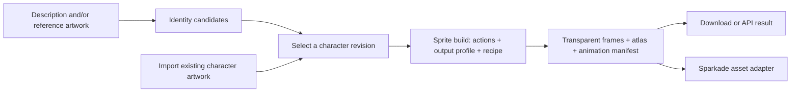

# Sprite utility: identities, recipes, and the service contract

Status: proposal, 2026-09-19. No standalone service or billing changes are implemented here.
This extends the [sprite-generation roadmap](sprite-generation.md) after the SAM comparison lab
checkpoint `707e52a`.

## Product boundary

Build two independently useful operations that share a character library:

1. **Create an identity.** A description, reference photo/artwork, or both produces a small set of
   character candidates. The customer selects a look and saves a reusable identity revision.
   Existing artwork can be imported directly, without buying a generated identity first.
2. **Build sprites from an identity.** An approved revision, requested poses/animations, output
   profile, and recipe produce transparent frames, an atlas, and playback metadata.

The website and public API use the same operations. Sparkade is another client, responsible for
mapping game requirements into requests and mapping approved results back into game assets.
The utility does not need a game description, game ID, archetype, or Sparkade asset-role enum.



Identity and sprite generation are separate purchases. Rerunning an animation should not require
recreating its character. Selecting a different recipe should not quietly redesign that character.

## Persistent objects

| Object | Responsibility |
| --- | --- |
| Character | Library entry with a name and a pointer to the current approved revision. |
| Identity revision | Immutable visual specification, approved references, their hashes, and lineage. Every build pins a revision. |
| Recipe version | Supported inputs and outputs, processing procedure, model configuration, retry/quality policies, and versioned implementation. |
| Job | One bounded identity-candidate or sprite-build operation, with input snapshot, progress, attempts, artifacts, and costs. |
| Sprite result | Immutable frame set, atlas, animation manifest, checks, and provenance from a successful build. |
| Quote | Expiring price and delivery specification tied to an exact request, recipe version, and pricing policy. |

An identity revision is more than a PNG. It records:

- The visual description and characteristics to preserve: hair, face, proportions, clothing,
  accessories, equipment, palette, and art style.
- Approved reference artifacts with declared roles/views, such as canonical, front, right, or back.
  A missing view remains missing; generating an approved additional view is explicit work.
- Its source description and private source artifacts, candidate/parent revision IDs, and whether
  selection was made by a person or an explicitly configured automatic review policy.

For v1, the identity revision represents a complete approved look, including outfit and style.
Changing those creates a derived revision. A separate identity/outfit/style composition system can
come later if customers need it; avoid making it mandatory for the first product.

An identity-candidate job completes when it delivers its candidate set. Choosing a candidate
creates a revision without another model call. The job does not stay running while a person
decides. Sparkade can make the same selection through its existing automatic identity review.
Rejecting a sprite build cannot mutate the identity revision used by other builds.

## Recipes are supported procedures

Recipes describe how an output is made. Models are implementations of steps inside the recipe.
Cleanup is another step, so selecting SAM should not itself imply a different animation recipe.

| Proposed recipe family | Procedure | Intended use | Cost factors to measure |
| --- | --- | --- | --- |
| Isolated poses | Generate/edit each pose from approved references, review the set, repair selected failures. | Specific action poses and targeted revisions. | Views/actions, candidates, reviews, bounded repairs. |
| Grouped pose sheets | Generate several instructed cells together, extract and validate them, repair missing cells. | Bundles of poses with a known layout. | Sheets plus extraction failures and individual repairs. |
| Video cycle | Animate a reference, select a cycle, segment, normalize jointly, pack frames. | Coherent walking, running, flying, and other repeated motion. | Clip duration/resolution, attempts, tracking and cycle review. |
| Imported video | Process supplied animation through cycle selection, segmentation, and packing. | Testing motion extraction and customers with existing clips. | Source duration/resolution and processing. |

These are hypotheses about useful workflows, not quality rankings. In particular, a sheet is not
necessarily cheaper after repairs, and a video is not necessarily a better loop. Benchmark cost
per accepted result, time to result, identity consistency, and motion quality.

A catalog entry declares supported views/actions, input references, frame-count limits, output
profiles, looping support, cleanup options, availability, and whether it is experimental. The UI
only offers recipes compatible with the current request; the API rejects unsupported combinations
before charging. A still-pose recipe must not claim to provide an eight-frame continuous run cycle
by duplicating two poses.

Public requests pin `recipeId` and `recipeVersion`; the server resolves provider/model settings,
prompts, processors, quality rules, and repair limits. Output-affecting changes create a new recipe
version. Price changes create a pricing version. An optional “recommended” choice resolves to a
concrete recipe before quoting, and that choice is visible and saved.

Expose a few meaningful controls, rather than every model's parameters. Keep validated cleanup
presets such as chroma and SAM hybrid available in the lab and, eventually, an advanced API option.
The quote includes the resolved configuration. A provider swap can fit the same adapter interface
but still needs a newly evaluated recipe version; prompts and supported controls may differ.

## Build contract

Separate **what is requested** from **how it is produced**. An illustrative resolved request is:

```json
{
  "schemaVersion": 1,
  "identityRevisionId": "identity_rev_123",
  "recipe": { "id": "video-cycle", "version": 1 },
  "output": {
    "profile": "side-view-pixel-art",
    "profileVersion": 1,
    "cell": { "width": 128, "height": 128 },
    "subjectHeightPx": 104,
    "rootPivot": { "x": 64, "y": 120 },
    "palette": { "mode": "shared", "maxColors": 32 },
    "alpha": "binary"
  },
  "clips": [
    {
      "name": "run-right",
      "action": "run",
      "view": "right",
      "frameCount": 8,
      "durationMs": 800,
      "loop": true,
      "motion": "in-place"
    }
  ]
}
```

This is a contract example, not an available video recipe. The first implemented profile should
match today's platformer output exactly. Additional profiles need capability checks and fixtures.

For v1 a build selects one recipe for all its clips. A pack can later assemble compatible clips
from different builds, retaining each clip's source job and recipe. Do not introduce a per-step
workflow editor into the initial customer API.

Contract rules:

- Reference artifacts are owned immutable IDs, not caller-supplied server paths. The service
  snapshots verified hashes. Identity generation requires a description or at least one reference.
- Coordinates use pixels with origin at the upper left and positive y downward. The root pivot is
  in the untrimmed cell; atlas trimming must preserve its offset. One scale, root convention, and
  palette apply across a clip. Preserve airborne motion instead of grounding each frame separately.
- A looping clip returns the requested number of frames with positive integer durations summing
  to its requested duration. The output must pass the recipe's motion and seam checks. Do not
  silently substitute a different frame count or call a crossfade a validated loop.
- In-place and root-motion output are distinct capabilities. Support in-place first. Mirroring
  directions is explicit because handed equipment, text, and asymmetric clothing can change.
- A successful build satisfies every required clip. Failed candidates and partial work may be
  retained for diagnosis, but do not masquerade as a completed pack. Intentional salvage or a
  reroll is a new request, with its own quote and lineage.

The result includes more than a sprite-sheet image:

| Result field | Meaning |
| --- | --- |
| Artifact references | PNG atlas and optional individual frames, hashes, dimensions, and expiring download links. |
| Frame table | Stable frame IDs, atlas rectangles, untrimmed cell dimensions, trim offsets, and root pivots. |
| Clips | Name, action, view, ordered frame IDs, per-frame durations, looping, and motion convention. |
| Quality report | Deterministic validation outcomes plus separately labeled model/human judgments and warnings. |
| Provenance | Identity revision, recipe/profile/processor versions, input hashes, resolved models, attempts, and source job IDs. |
| Delivery receipt | Quote, credits settled, terminal outcome, and usage identifiers; raw provider cost stays an internal concern. |

Generic PNG + JSON is the first export. Engine-specific formats can be deterministic exporters on
that manifest. Sparkade's gameplay labels, collision logic, and atomic asset activation belong in
its adapter. A more detailed silhouette must never implicitly change collision geometry.

The SAM lab illustrates why quality dimensions must stay separate: an absence of green pixels is
not proof of a good mask when a character intentionally contains green. Evaluate edge residue,
foreground retention, identity, palette stability, and animation coherence independently.

## API and website flow

Proposed resource surface, shared by the website and external clients:

| Endpoint | Purpose |
| --- | --- |
| `POST /v1/artifacts` | Upload/register a private reference with type, size, and ownership validation. |
| `GET /v1/recipes` | Discover versioned capabilities and availability for identity or sprite operations. |
| `POST /v1/quotes` | Validate an identity/build request and return a fixed credit price and immutable request fingerprint. |
| `POST /v1/identity-jobs` | Submit an identity-candidate operation using a quote and an idempotency key. |
| `POST /v1/characters` | Create a library entry. |
| `POST /v1/characters/:id/revisions` | Approve a delivered candidate or import existing artwork into an immutable revision. |
| `GET /v1/characters/:id` | Read the library entry and available revisions. |
| `POST /v1/sprite-jobs` | Build from a pinned identity revision and quote. |
| `GET /v1/jobs/:id` | Read durable status, stage, result references, and settlement. |
| `GET /v1/jobs/:id/events?after=...` | Resume progress from a cursor. |
| `POST /v1/jobs/:id/cancel` | Request cancellation and prevent subsequent delivery/charging according to the quote policy. |

Job submission returns `202` and a stable ID. The owner comes from authentication, never a trusted
request-body field. Same owner/operation/idempotency key and same request returns the existing job;
changed input conflicts. Accepting a quote, reserving credits, and creating the job must be atomic.

Use job states `queued`, `running`, `succeeded`, `rejected`, `failed`, and `canceled`. Record the
current stage separately: generating, segmenting, normalizing, validating, or packing. A quality
rejection is distinguishable from an infrastructure failure. Cancellation and delivery race through
one atomic terminal transition, with settlement reconciled exactly once.

The website flow is: character library → create/import → choose a look → choose actions and format
→ compare compatible recipes and their quoted prices → generate → animated review → download.
Save results per character so someone can add a jump next week without rebuilding their run cycle.

## Credits and bounded execution

Recommend a fixed quote per deliverable for the first customer product. Keep credit prices separate
from provider dollars and tune them from measured accepted-output cost, including reviews, retries,
compute, and storage. Do not publish invented prices before that benchmark exists.

Proposed policy to validate before launch:

1. Reserve the quoted credits when the job is accepted. Pin the included candidate count or clips,
   configuration, retry allowance, price version, and delivery criteria.
2. Capture once when the promised candidate set or validated sprite result is delivered. The
   customer's later aesthetic choice does not determine whether a completed candidate job is paid.
3. Release the reservation on technical failure, hard quality rejection, or cancellation before
   delivery. The service absorbs any provider spend already incurred under its bounded budget.
4. A new creative attempt after successful delivery is a separately quoted operation. Restarting
   a worker or re-fetching a result is not a new purchase.

Each recipe also has an internal spend ceiling and attempt limits. Before external work, reserve
its worst-case authorized cost; reconcile actual usage afterward. The customer quote is never
silently exceeded. Track customer settlement separately from provider usage, including failed
attempts, cache reuse, and canceled provider work that could not be stopped.

The existing website already has credit reservations and settlement in
[`website-generation.ts`](../../apps/site/lib/website-generation.ts), but they are attached to games.
Extract/generalize the useful ledger operations when needed rather than giving sprite jobs fake
game records or double-charging a sprite child job inside a paid Sparkade generation.

## Implementation boundary and next slice

Start with a logical service inside this repository. `packages/spriting` can own portable contracts,
recipe descriptors, artifact manifests, validation, and deterministic processing. Provider calls,
artifact storage, job execution, and billing are injected host interfaces. Keep game IDs and game
roles in a Sparkade adapter. A separate website or worker deployment can follow independently.

There is useful infrastructure to reuse, but not a ready-made independent sprite service:

- The platformer lab already creates front-idle candidates, reviews identity, and derives a shared
  side reference before generating motion candidates.
- The main runner has similar character flows with persisted references, model judgments, and
  bounded repairs, but these are coupled to game roles and asset storage.
- The durable pass currently suspends/resumes text and image work. Segmentation and asynchronous
  video submission/polling need explicit task kinds; large media belongs in artifact storage,
  not base64 checkpoint JSON. Persist external job IDs and archive results before URLs expire.
- The masking lab can replay exact saved SAM responses. Preserve that distinction between replaying
  saved work and rerunning a stochastic model call. Provider idempotency gaps remain explicit.

The next implementation slice should prove the boundary with today's working still-image path:

1. Add versioned runtime schemas and manifest types for an imported identity revision, a sprite
   build, an output profile, a recipe descriptor, and a result.
2. Wrap one existing platformer pose path as a single recipe, preserving its current prompts,
   review/repair limits, dimensions, and output semantics. Initially support importing an existing
   approved reference; add generated identity candidates through the same revision contract next.
3. Make the lab a client of that contract and have a Sparkade adapter consume its result. Verify
   malformed/unsupported requests, identity immutability, output parity, retries, and artifact replay.
4. Add quote/usage interfaces without implementing checkout or claiming public credit prices. Bind
   the existing ledger only when durable sprite job ownership and settlement are ready.
5. Add an imported-video recipe returning the same manifest. Use it to prove frame timing, pivots,
   shared normalization, and animated review before introducing a paid video provider.

This gives a separately usable asset contract before committing to a second deployment, a provider,
or a commercial pricing scheme. The next decision is which narrow profile and existing pose path
to wrap first; the current platformer lab is the most direct candidate.
